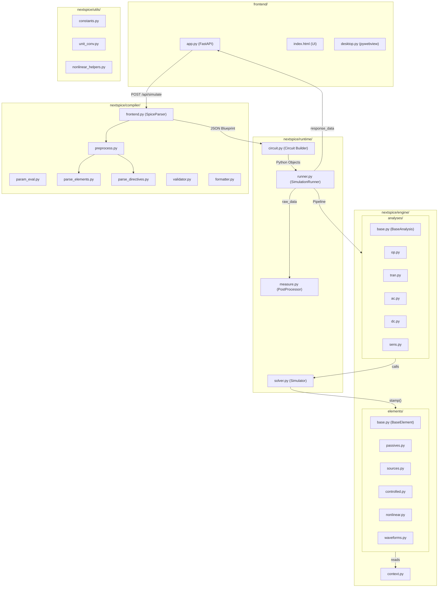

# NextSPICE 架構總覽與模組撰寫規則

> 本文檔是 NextSPICE 引擎的完整架構指南，涵蓋每個資料夾的職責、函式撰寫規則、以及新增功能時應遵守的設計模式。

---

## 全域架構圖



---

## 資料流（Data Pipeline）

```
.cir 文字 ──▶ SpiceParser.compile() ──▶ JSON Blueprint ──▶ Circuit.build_from_json()
                                                                    │
                                                          Python Element 物件
                                                                    │
                                                          SimulationRunner.run_all()
                                                                    │
                                              ┌─────────────────────┼──────────────────────┐
                                              │                     │                      │
                                     Analysis Pipeline         PostProcessor          _build_frontend_plots()
                                     (OP/TRAN/AC/DC/SENS)     (.MEAS / .FOUR)          (Plotly JSON)
                                              │                     │                      │
                                              └─────────────────────┼──────────────────────┘
                                                                    │
                                                              response_data ──▶ 前端 UI
```

---

## 1. `nextspice/compiler/` — 編譯器層

### 職責
將 SPICE 網表文字編譯成**標準化 JSON Blueprint**，供 Runtime 消費。

### 檔案與規則

| 檔案 | 職責 | 撰寫規則 |
|------|------|----------|
| [preprocess.py](file:///c:/Users/Tudo/Downloads/NEXTSPICE/nextspice/compiler/preprocess.py) | 行合併 (`+` 續接)、註解移除、Tokenizer | 純函式，無副作用。輸入 `raw_lines`，輸出 `[(line_no, content)]` |
| [param_eval.py](file:///c:/Users/Tudo/Downloads/NEXTSPICE/nextspice/compiler/param_eval.py) | `.PARAM` 環境建立、數值求值 (`eval_val`) | 提供 `eval_func(str) → float`，支援科學記號與 SPICE 單位後綴 |
| [parse_elements.py](file:///c:/Users/Tudo/Downloads/NEXTSPICE/nextspice/compiler/parse_elements.py) | 元件行解析 (R, C, L, V, I, D, Q, E, G, H, F, K, X) | **依字首 prefix 分流**，輸出標準化元件字典推入 `circuit["elements"]` |
| [parse_directives.py](file:///c:/Users/Tudo/Downloads/NEXTSPICE/nextspice/compiler/parse_directives.py) | 指令行解析 (.TRAN, .AC, .DC, .OP, .SENS, .STEP, .MODEL, .MEAS, .FOUR) | 推入 `circuit["analyses"]`、`circuit["measures"]` 等對應欄位 |
| [frontend.py](file:///c:/Users/Tudo/Downloads/NEXTSPICE/nextspice/compiler/frontend.py) | `SpiceParser` 主類別，協調所有子模組，處理 `.SUBCKT` 展平 | 唯一對外 API：`parser.compile() → { "circuit": {...}, "diagnostics": [...] }` |
| [validator.py](file:///c:/Users/Tudo/Downloads/NEXTSPICE/nextspice/compiler/validator.py) | 電路拓撲驗證 | 驗證結果推入 `diagnostics` 陣列 |
| [formatter.py](file:///c:/Users/Tudo/Downloads/NEXTSPICE/nextspice/compiler/formatter.py) | SPICE 程式碼排版 | 純文字處理函式 |

### 新增元件解析規則

在 [parse_elements.py](file:///c:/Users/Tudo/Downloads/NEXTSPICE/nextspice/compiler/parse_elements.py) 中新增 `elif prefix == 'X':` 區塊：

```python
elif prefix == 'M':       # 例如新增 MOSFET
    if len(tk) < 6: raise ValueError("M requires D, G, S, B nodes and model")
    circuit["elements"].append({
        "type": "mosfet",           # ← type 必須是小寫字串
        "name": name,               # ← name 保持大寫
        "drain": norm_node(tk[1]),   # ← 節點一律用 norm_node() 正規化
        "gate": norm_node(tk[2]),
        "source": norm_node(tk[3]),
        "bulk": norm_node(tk[4]),
        "model": tk[5].upper()      # ← model 名稱大寫
    })
```

### JSON Blueprint 結構約定

```python
circuit = {
    "schema":     "nextspice.circuit.v0.1",
    "name":       str,
    "metadata":   { "source": str, "compiled_at": str },
    "options":    { "RELTOL": float, "SOLVER": str, ... },
    "params":     { "PI": 3.14, ... },
    "elements":   [ { "type": str, "name": str, "pins": {}, ... }, ... ],
    "models":     [ { "name": str, "type": str, "params": {} }, ... ],
    "analyses":   [ { "type": "op"|"tran"|"ac"|"dc"|"sens", ... }, ... ],
    "subckts":    { "NAME": { "pins": [], "elements": [] } },
    "measures":   [ { "analysis_type": str, "name": str, "operation": str, ... } ],
    "fourier":    [ { "freq": float, "targets": [str] } ],
    "step_config": { "target": str, "start": float, "stop": float, "step": float } | None,
    "outputs":    [ { "type": str, "analysis_type": str, "targets": [str] } ]
}
```

---

## 2. `nextspice/engine/elements/` — 元件物件層

### 職責
定義所有電路元件的 MNA 蓋章 (Stamping) 行為。

### 基底類別 `BaseElement` 契約

所有元件**必須**繼承 [BaseElement](file:///c:/Users/Tudo/Downloads/NEXTSPICE/nextspice/engine/elements/base.py) 並遵守以下介面：

```python
class BaseElement:
    name: str              # 元件名稱 (大寫)
    extra_vars: int = 0    # 需要額外的 MNA 變數數量 (例如 VoltageSource = 1)
    is_nonlinear: bool = False

    def requires_extra(self) -> bool:
        """Build-time 檢查：是否需要分配 extra_idx"""
        return self.extra_vars > 0

    def stamp(self, A, b, extra_idx=None, ctx=None):
        """線性蓋章 — DC/AC/TRAN 共用入口"""
        raise NotImplementedError

    def stamp_nonlinear(self, A, b, x_old, extra_idx=None, ctx=None):
        """非線性蓋章 — 僅 is_nonlinear=True 的元件實作"""
        pass

    def update_history(self, x, extra_idx=None, ctx=None):
        """TRAN 時步推進後更新歷史狀態 (電容、電感必須實作)"""
        pass
```

### 撰寫規則

> [!IMPORTANT]
> 1. **節點索引**：`n1`, `n2` 為 MNA 矩陣索引 (1-based)。`0` 代表接地。蓋章時用 `n1 - 1` 轉為 0-based。
> 2. **ctx 參數**：`stamp()` 必須接受 `ctx: AnalysisContext`，透過 `ctx.mode` 判斷當前分析型態 (`'op'`, `'dc'`, `'ac'`, `'tran'`)。
> 3. **狀態管理**：**禁止**在元件物件上儲存可變狀態 (`self.v_prev` 等)。改用 `ctx.state_mgr.get(self, key)` / `.set(self, key, value)`。
> 4. **extra_idx**：需要額外支路電流變數的元件 (V, L, VCVS, CCVS, CCCS) 必須設定 `self.extra_vars = 1`，Simulator 會自動分配 `extra_idx`。
> 5. **數值穩定**：使用 `nextspice.utils.constants` 中的常數 (`GMIN_NONLINEAR`, `GMIN_DC_PULLDOWN`, `EXP_LIMIT` 等)。

### 各檔案歸類

| 檔案 | 包含的元件 | 特點 |
|------|-----------|------|
| [passives.py](file:///c:/Users/Tudo/Downloads/NEXTSPICE/nextspice/engine/elements/passives.py) | `Resistor`, `Capacitor`, `Inductor`, `MutualInductance` | C/L 需實作 `update_history()`，支援 BE/Trapezoidal/Gear2 |
| [sources.py](file:///c:/Users/Tudo/Downloads/NEXTSPICE/nextspice/engine/elements/sources.py) | `VoltageSource`, `CurrentSource` | 有 `waveform` 屬性，`stamp()` 依 `ctx.mode` 切換 DC/AC/TRAN |
| [controlled.py](file:///c:/Users/Tudo/Downloads/NEXTSPICE/nextspice/engine/elements/controlled.py) | `VCVS`, `VCCS`, `CCVS`, `CCCS` | 受控源，CCVS/CCCS 需引用控制源名稱 |
| [nonlinear.py](file:///c:/Users/Tudo/Downloads/NEXTSPICE/nextspice/engine/elements/nonlinear.py) | `Diode`, `LED`, `BJT` | `is_nonlinear = True`，必須實作 `stamp_nonlinear()`，LED 繼承 Diode |
| [waveforms.py](file:///c:/Users/Tudo/Downloads/NEXTSPICE/nextspice/engine/elements/waveforms.py) | `SinWaveform`, `PulseWaveform`, `PWLWaveform` | 由 `compile_waveform()` 工廠函式建立 |

### 新增元件範例 (e.g. MOSFET)

```python
# nextspice/engine/elements/mosfet.py
from .base import BaseElement
from nextspice.utils.constants import GMIN_NONLINEAR, EXP_LIMIT

class MOSFET(BaseElement):
    def __init__(self, name, nd, ng, ns, nb, ...):
        super().__init__(name)
        self.nd, self.ng, self.ns, self.nb = nd, ng, ns, nb
        self.is_nonlinear = True      # ← 非線性元件
        # self.extra_vars = 0         # MOSFET 通常不需要額外變數

    def stamp_nonlinear(self, A, b, x_old, extra_idx=None, ctx=None):
        # 1. 從 x_old 取得節點電壓
        # 2. 從 ctx.state_mgr 取得歷史狀態
        # 3. 計算等效電導 & 等效電流源
        # 4. 蓋章到 A, b
        # 5. 將本次結果寫入 ctx.state_mgr
        pass
```

然後在 [\_\_init\_\_.py](file:///c:/Users/Tudo/Downloads/NEXTSPICE/nextspice/engine/elements/__init__.py) 中註冊：
```python
from .mosfet import MOSFET
```

---

## 3. `nextspice/engine/context.py` — 分析上下文

### 職責
提供 **AnalysisContext** (強型別上下文) 和 **StateManager** (狀態管理器)。

### `AnalysisContext` 欄位

| 欄位 | 型別 | 說明 |
|------|------|------|
| `mode` | `str` | `"op"`, `"dc"`, `"ac"`, `"tran"` |
| `freq` | `float` | AC 分析頻率 |
| `t` | `float` | TRAN 當前時間 |
| `dt` | `float` | TRAN 時步 |
| `integration` | `str` | 積分方法 `"be"`, `"trapezoidal"`, `"gear2"` |
| `extra_map` | `dict` | `{ element_obj: extra_idx }` |
| `extra_by_name` | `dict` | `{ "V1": extra_idx }` |
| `state_mgr` | `StateManager` | 統一狀態存取 |
| `is_dc_op_valid` | `bool` | DC OP 是否收斂成功 |

### `StateManager` API

```python
state_mgr.get(element, key, default=0.0, scope='default')  # 讀取
state_mgr.set(element, key, value, scope='default')         # 寫入
state_mgr.clone()                                           # 深拷貝 (用於 Rollback)
```

> [!TIP]
> StateManager 以 `(id(element), scope, key)` 為唯一鍵。`scope` 可用來隔離不同分析階段的狀態。

---

## 4. `nextspice/engine/analyses/` — 分析策略層 (Strategy Pattern)

### 職責
每個分析類型是一個獨立的 Strategy 物件，封裝所有分析邏輯。

### 基底類別 `BaseAnalysis` 契約

```python
class BaseAnalysis:
    def __init__(self, config: dict):
        self.config = config                               # 原始 JSON 設定
        self.atype = config.get("type", "unknown").lower() # 分析類型字串

    def run(self, simulator, circuit, step_suffix="") -> dict:
        """
        回傳值必須符合以下格式：
        {
            "status": "SUCCESS" | "ERROR",
            "atype": str,          # e.g. "op", "tran"
            "suffix": str,         # STEP 掃描的後綴
            "data": ...,           # 結果數據 (dict 或 list)
            "message": str         # (ERROR 時提供)
        }
        """
        raise NotImplementedError

    def safe_num(self, val) -> float:
        """共用浮點數安全轉換"""
```

### 註冊新分析

1. 在 `analyses/` 下建立新檔案 (e.g. `tf.py`)
2. 繼承 `BaseAnalysis` 並實作 `run()`
3. 在 [\_\_init\_\_.py](file:///c:/Users/Tudo/Downloads/NEXTSPICE/nextspice/engine/analyses/__init__.py) 中加入 Registry：

```python
from .tf import TFAnalysis

ANALYSIS_REGISTRY = {
    "op": OPAnalysis,
    "tran": TRANAnalysis,
    "ac": ACAnalysis,
    "dc": DCSweepAnalysis,
    "sens": SENSAnalysis,
    "tf": TFAnalysis,        # ← 新增
}
```

4. `build_analysis(config)` 工廠函式會自動根據 `config["type"]` 實體化對應的 Analysis 物件。

> [!WARNING]
> Analysis 類別**不應**直接操作 `response_data` 或畫圖邏輯。它只負責呼叫 `simulator` 並回傳標準化結果字典。

---

## 5. `nextspice/runtime/` — 執行時期層

### 職責
將 JSON Blueprint 實體化為物件、排程分析、求解、後處理。

### 檔案與規則

| 檔案 | 類別 | 職責 | 撰寫規則 |
|------|------|------|----------|
| [circuit.py](file:///c:/Users/Tudo/Downloads/NEXTSPICE/nextspice/runtime/circuit.py) | `Circuit`, `NodeManager`, `BuildResult` | JSON → Python 物件轉換 | 新增元件時，加入 `_build_xxx()` 方法，並在 `build_from_json()` 的 dispatch 中新增條目 |
| [solver.py](file:///c:/Users/Tudo/Downloads/NEXTSPICE/nextspice/runtime/solver.py) | `Simulator`, `SimulatorOptions`, `SolverResult` | Newton-Raphson 迴圈、OP/AC/TRAN/DC/SENS/TF 求解器 | **核心數學引擎**，不應包含 UI 或格式化邏輯 |
| [runner.py](file:///c:/Users/Tudo/Downloads/NEXTSPICE/nextspice/runtime/runner.py) | `SimulationRunner` | 排程總管 (Dispatcher)，STEP 掃描、Pipeline 調度、前端繪圖打包 | **全解耦**：不包含任何數學邏輯，完全交由 Analysis Pipeline |
| [measure.py](file:///c:/Users/Tudo/Downloads/NEXTSPICE/nextspice/runtime/measure.py) | `PostProcessor` | `.MEASURE` 與 `.FOUR` 後處理 | 基於 `raw_data` 的純數據分析，不修改前端 `response_data` |

### `Circuit.build_from_json()` 新增元件步驟

```python
# 1. 在 build_from_json() 的 dispatch 區塊新增：
elif el_type == "mosfet":
    self._build_mosfet(el_data, warnings)

# 2. 實作 _build_mosfet() 方法：
def _build_mosfet(self, data, warnings):
    nd = self.node_mgr.get_node_index(data.get("drain"))
    ng = self.node_mgr.get_node_index(data.get("gate"))
    ns = self.node_mgr.get_node_index(data.get("source"))
    nb = self.node_mgr.get_node_index(data.get("bulk"))

    # 讀取 .MODEL 參數
    params = self._get_model_params(data.get("model"), "M")

    self._add_element(MOSFET(data["name"], nd, ng, ns, nb, ...))
```

### `Simulator` 求解器架構

```
Simulator
├── _prepare_mna_structure()   → 分配 extra_idx，計算 dim
├── _stamp_system()            → 對所有元件呼叫 stamp() / stamp_nonlinear()
├── _linear_solve()            → spsolve / GMRES / BiCGSTAB
├── _nr_loop()                 → 通用 Newton-Raphson 迴圈
├── solve_op()                 → OP 分析 (含 Source Stepping 回退)
├── solve_ac()                 → AC 小訊號分析 (重用 OP State)
├── solve_tran()               → 暫態分析 (含時步切半 Rollback)
├── solve_dc_sweep()           → DC 掃描分析
├── solve_tf()                 → 轉移函數分析
├── solve_sens_perturbation()  → 敏感度分析 (擾動法)
└── get_full_report()          → MNA 解向量 → 人類可讀報表
```

### `SimulationRunner` Pipeline 流程

```python
# 初始化時：
for cfg in circuit_json["analyses"]:
    self.pipeline.append(build_analysis(cfg))   # Factory Pattern

# run_all() 主迴圈：
for step_val in step_values:        # STEP 掃描
    simulator = Simulator(circuit)  # 每步重建
    for analysis in self.pipeline:  # Pipeline 調度
        res = analysis.run(simulator, circuit, step_suffix=suffix)
        self.raw_data[atype].append(res)

# 後處理：
post_processor = PostProcessor(...)
self._build_frontend_plots(...)     # 轉 Plotly JSON
```

---

## 6. `nextspice/utils/` — 工具函式庫

### 撰寫規則

| 檔案 | 職責 | 規則 |
|------|------|------|
| [constants.py](file:///c:/Users/Tudo/Downloads/NEXTSPICE/nextspice/utils/constants.py) | 全域數值/物理常數 | **唯一真相來源**。所有 GMIN、EXP_LIMIT 等常數集中定義於此 |
| [unit_conv.py](file:///c:/Users/Tudo/Downloads/NEXTSPICE/nextspice/utils/unit_conv.py) | SPICE 單位轉換 (`1k` → `1000`) | 純函式，`UnitConverter.parse(str) → float` |
| [nonlinear_helpers.py](file:///c:/Users/Tudo/Downloads/NEXTSPICE/nextspice/utils/nonlinear_helpers.py) | `adaptive_junction_clamp()` 等非線性收斂輔助 | 純數學工具函式 |

> [!CAUTION]
> 新增常數或修改既有常數時，務必在 `constants.py` 中加上詳細註解說明用途。數值的選擇會直接影響全引擎的收斂性。

---

## 7. `frontend/` — 前端應用層

### 檔案

| 檔案 | 職責 |
|------|------|
| [app.py](file:///c:/Users/Tudo/Downloads/NEXTSPICE/frontend/app.py) | FastAPI 伺服器，定義 REST API 端點 |
| [desktop.py](file:///c:/Users/Tudo/Downloads/NEXTSPICE/frontend/desktop.py) | pywebview 桌面視窗啟動器 |
| [index.html](file:///c:/Users/Tudo/Downloads/NEXTSPICE/frontend/index.html) | 單頁應用 (SPA)，CodeMirror 編輯器 + Plotly 繪圖 |

### API 端點

| Method | Path | 功能 |
|--------|------|------|
| `GET` | `/` | 回傳 `index.html` |
| `GET` | `/api/version` | 引擎版本資訊 |
| `GET` | `/api/elements` | 支援的元件清單 |
| `POST` | `/api/netlist-info` | 網表摘要 (元件數、節點數) |
| `POST` | `/api/simulate` | **核心**：編譯 + 建構 + 求解 + 回傳結果 |
| `POST` | `/api/format` | SPICE 程式碼排版 |

### `/api/simulate` 回傳格式

```python
response_data = {
    "status": "success" | "error",
    "logs": [str],                      # 日誌訊息
    "plots": [{ "name": str, "x": [float], "y": [float], "type": "solid"|"dash" }],
    "layout": { "title": str, "xaxis": str, "yaxis": str, "is_ac": bool },
    "op_results": { "V(OUT)": float, "I(V1)": float, ... },
    "tran_results": [{ "time": float, "V(OUT)": float, ... }]     # (optional)
}
```

---

## 8. `tests/` — 測試電路

存放 `.cir` 測試案例，按難度分級：

| 前綴 | 難度 | 涵蓋範圍 |
|------|------|---------|
| `Lv1_*` | 基礎 | 純 RLC、單一電源 |
| `Lv2_*` | 中階 | 受控源、二極管、基本非線性 |
| `Lv3_*` | 進階 | BJT、子電路、多分析混合 |
| `boss_*` | Boss | 完整 TRAN + MEAS + FOUR |
| 其他 | 特殊案例 | 變壓器、橋式整流、石英振盪器 |

---

## 設計原則摘要

> [!NOTE]
> ### 6 條核心撰寫規則
>
> 1. **單一職責**：Compiler 只產 JSON、Engine 只做數學、Runtime 只協調流程、Frontend 只做 UI。
> 2. **狀態外部化**：元件不存可變狀態 → 全部透過 `ctx.state_mgr` 存取，支援 Clone/Rollback。
> 3. **強型別上下文**：所有 `stamp()` 函式都接收 `AnalysisContext`，透過 `ctx.mode` 判斷行為。
> 4. **Strategy + Registry**：新增分析型態只需繼承 `BaseAnalysis` + 註冊到 `ANALYSIS_REGISTRY`。
> 5. **Runner 不碰數學**：`SimulationRunner` 是純調度層，所有計算都委託給 Analysis 和 Simulator。
> 6. **常數集中管理**：所有數值常數定義在 `utils/constants.py`，避免 Magic Number 散落各處。

---

## 快速檢查表：新增一個完整功能

以「新增 MOSFET 元件 + .NOISE 分析」為例：

| 步驟 | 所在檔案 | 動作 |
|------|---------|------|
| 1 | `compiler/parse_elements.py` | 新增 `elif prefix == 'M':` 解析區塊 |
| 2 | `engine/elements/mosfet.py` | 建立 `MOSFET(BaseElement)` 類別，實作 `stamp()` / `stamp_nonlinear()` |
| 3 | `engine/elements/__init__.py` | `from .mosfet import MOSFET` |
| 4 | `runtime/circuit.py` | 新增 `_build_mosfet()` 方法 + dispatch 條目 |
| 5 | `utils/constants.py` | 若需要新常數，在此定義 |
| 6 | `compiler/parse_directives.py` | 新增 `elif cmd == '.NOISE':` 解析區塊 |
| 7 | `engine/analyses/noise.py` | 建立 `NOISEAnalysis(BaseAnalysis)` |
| 8 | `engine/analyses/__init__.py` | 加入 `"noise": NOISEAnalysis` 到 Registry |
| 9 | `runtime/solver.py` | 若需要新的求解模式，在 Simulator 中新增 `solve_noise()` |
| 10 | `runtime/runner.py` | 在 `_build_frontend_plots()` 中處理 `raw_data["noise"]` 的繪圖邏輯 |
| 11 | `frontend/app.py` | 更新 `SUPPORTED_ELEMENTS` / `SUPPORTED_ANALYSES` |
| 12 | `tests/` | 新增 `.cir` 測試案例 |
